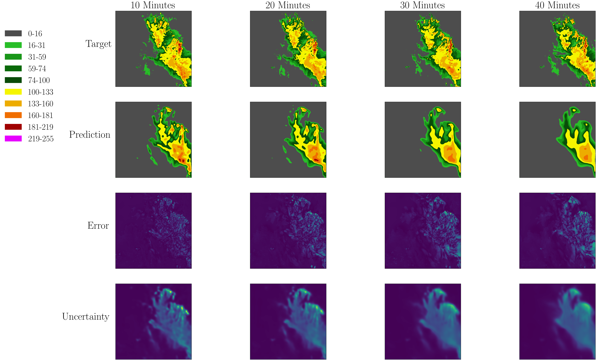

## Evidential Storm Forecasting

By [Ayush Khot](https://scholar.google.com/citations?view_op=list_works&hl=en&user=J78JjZ4AAAAJ), [Xihaier Luo](https://xihaier.github.io/), [Ai Kagawa](https://www.bnl.gov/staff/kagawa), and [Shinjae Yoo](https://www.cs.cmu.edu/~sjyoo/)

This repo is the official implementation of "Evidential deep learning for probabilistic modelling of extreme storm events"

## Tutorials

- [EDL and Bayesian Comparison Tutorial on SEVIR](./notebooks/ComparativePlotter.ipynb). [](https://studiolab.sagemaker.aws/import/github/SULI24/edl-stormcast/blob/main/notebooks/ComparativePlotter.ipynb) [](https://colab.research.google.com/github/SULI24/edl-stormcast/blob/main/notebooks/ComparativePlotter.ipynb)
- [EDL Visualization Tutorial on SEVIR](./notebooks/ComparativePlotter.ipynb). [](https://studiolab.sagemaker.aws/import/github/SULI24/edl-stormcast/blob/main/notebooks/EDL-Evaluation.ipynb) [](https://colab.research.google.com/github/SULI24/edl-stormcast/blob/main/notebooks/EDL-Evaluation.ipynb)

## Introduction

Uncertainty quantification (UQ) methods play an important role in reducing errors in weather forecasting. Conventional approaches in UQ for weather forecasting rely on generating an ensemble of forecasts from physics-based simulations to estimate the uncertainty. However, it is computationally expensive to generate many forecasts to predict real-time extreme weather events. Evidential Deep Learning (EDL) is an uncertainty-aware deep learning approach designed to provide confidence about its predictions using only one forecast. It treats learning as an evidence acquisition process where more evidence is interpreted as increased predictive confidence. Using this method, we compare current Bayesian methods with EDL and perform storm forecasting using the Storm EVent ImageRy (SEVIR) dataset. We apply EDL to storm forecasting using real-world weather datasets and compare its performance with traditional methods. Our findings indicate that EDL not only reduces computational overhead but also enhances predictive uncertainty. This method opens up novel opportunities in research areas such as climate risk assessment, where quantifying the uncertainty about future climate is crucial.

A visualization example of the EDL uncertainty and prediction is below:


## Installation

We recommend managing the environment through Anaconda. 

First, create a new conda environment:

```bash
conda create -n edl-st python=3.9
conda activate edl-st
```

Make sure that `pip < 24.1`. If it isn't, run:

```bash
conda install pip=24.0
```

Lastly, install dependencies. SciencePlots requires Latex on your machine, instructions can be found [here](https://github.com/garrettj403/SciencePlots/wiki/FAQ#installing-latex).

```bash
python3 -m pip install torch==1.12.1+cu116 torchvision==0.13.1+cu116 -f https://download.pytorch.org/whl/torch_stable.html
python3 -m pip install pytorch_lightning==1.6.4
python3 -m pip install xarray netcdf4 opencv-python earthnet==0.3.9
python3 -m pip install omegaconf matplotlib SciencePlots
python3 -m pip install torchinfo h5py thop
```

You may need to do `python3 -m pip install lightning-fabric` at the end if you still get errors with `train.py`.

## Dataset

[Storm EVent ImageRy (SEVIR) dataset](https://sevir.mit.edu/) is a spatiotemporally aligned dataset containing over 10,000 weather events.
We adopt NEXRAD Vertically Integrated Liquid (VIL) mosaics in SEVIR for benchmarking precipitation nowcasting, i.e., to predict the future VIL up to 60 minutes given 65 minutes context VIL. 
The resolution is thus $13\times 384\times 384\rightarrow 12\times 384\times 384$.

To download SEVIR dataset from AWS S3, run:

```bash
cd ROOT_DIR/edl-stormcast
aws s3 cp --no-sign-request s3://sevir/CATALOG.csv ./dataset/CATALOG.csv
aws s3 cp --no-sign-request --recursive s3://sevir/data/vil ./dataset/data/vil
```

A visualization example of SEVIR VIL sequence:


## Training

To train the models, run the following command:


```bash
python train.py <options>
```

The available options are:

```

  -h, --help            show this help message and exit
  --model {unet,earthformer}
                        Choose between model type of UNet and Earthformer
  --save SAVE           Name of folder to save results in edl-stormcast/models/experiments/
  --gpus GPUS           Number of GPUs
  --cfg CFG             Load settings form file in yaml format
  --test                Set this flag when only testing the model
  --pretrained          Load pretrained checkpoints for test.
  --ckpt_name CKPT_NAME
                        The model checkpoint trained on SEVIR.
  --pretrain_baseline   Use pretrained model baseline without EDL as starting checkpoint
```

An example of running EDL models on the SEVIR dataset, looks like:

```bash
cd ROOT_DIR/edl-stormcast
python train.py --cfg config/cfg_earthformer_edl_1_drop_0.yaml --save earthformer_edl_1_drop_0
```

## Cite
